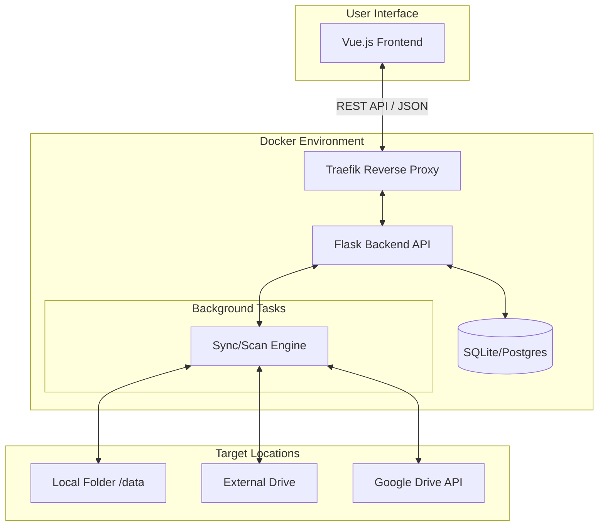

# Architecture

```mermaid
graph TD
    subgraph Client_Side [User Interface]
        UI[Vue.js Frontend]
    end

    subgraph Server_Side [Docker Environment]
        Proxy[Traefik Reverse Proxy]
        API[Flask Backend API]
        
        subgraph Workers [Background Tasks]
            Scanner[Sync/Scan Engine]
        end
        
        DB[(SQLite/Postgres)]
    end

    subgraph Storage_Locations [Target Locations]
        Local[Local Folder /data]
        USB[External Drive]
        Cloud[Google Drive API]
    end

    UI <-->|REST API / JSON| Proxy
    Proxy <--> API
    API <--> DB
    API <--> Scanner
    
    Scanner <--> Local
    Scanner <--> USB
    Scanner <--> Cloud
```